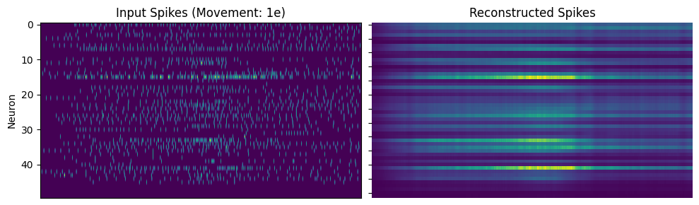
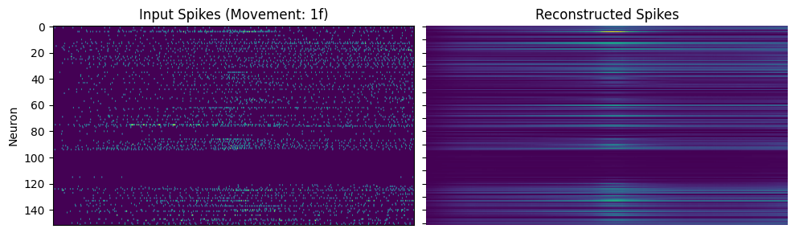
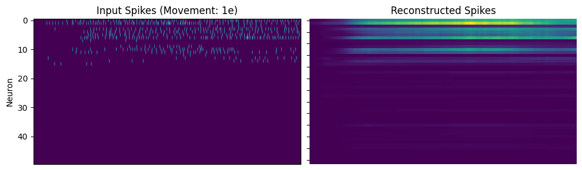
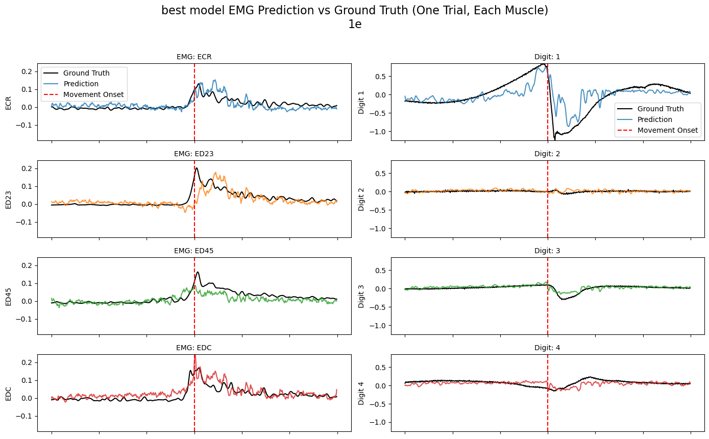
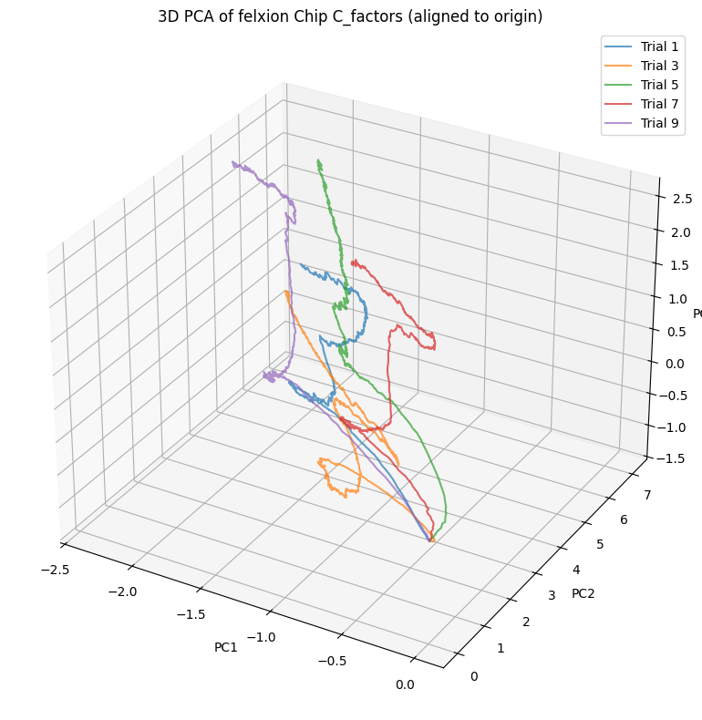
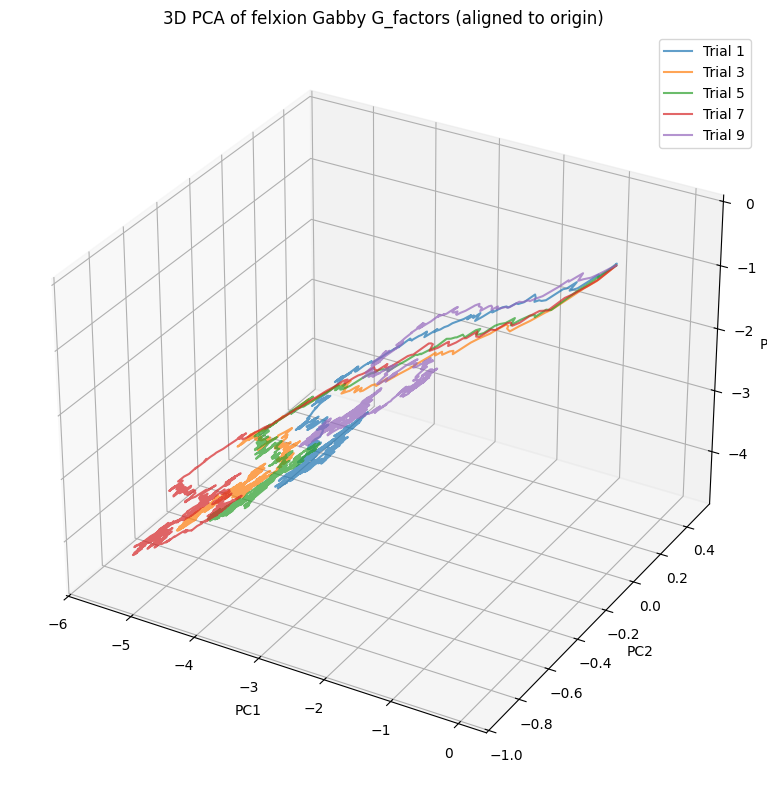

# Cross-Subject Movement Decoding using Neural Networks
**Deep Learning Approaches for Motor Cortex Analysis**

<div align="center">


*Neural activity trajectories during different movements (PCA projection - each color represents a different movement)*


**Daniel Katz & Roi Wayner**  
*Deep Learning for Physiological Signals (3360209)*  
*Faculty of Biomedical Engineering, Technion, Israel Institute of Technology*

[](https://www.python.org/downloads/)
[](https://pytorch.org/)
[](https://github.com/lfads)

 
*Neural activity input and reconstruction using 15 Factor LFADS model*

</div>

---

## 📖 Overview

This project **implemented and evaluated** multiple deep learning approaches for cross-subject movement classification using motor cortex neural recordings from two Rhesus monkeys (**Chip** & **Gabby**). We **systematically compared** baseline CNN models with advanced approaches including **LFADS** (Latent Factor Analysis via Dynamical Systems) to classify 12 different cued digit/wrist movements and **assessed** generalization across subjects. 

### 🎯 Research Contributions
- **Cross-subject neural decoding** analysis performed between two primates
- **LFADS implementation** for latent dynamics extraction (15 & 100 factors)
- **CNN baselines** developed 
- **EMG reconstruction and finger kinematics** from neural activity
- **Comprehensive evaluation** of generalization across subjects and movement types

<div align="center">


*LFADS reconstruction of neural activity patterns*

 
*LFADS reconstruction quality for Gabby dataset: (Left) Source neural data, (Right) Reconstructed patterns*

</div>

---

## 🧪 Experimental Design

### Subjects & Data
- **🐒 Chip**: 152 active motor cortex neurons, complete train/validation/test splits
- **🐒 Gabby**: 50 active motor cortex neurons, test set only
- **📊 Movements**: 12 cued movements (digit 1-5 and wrist flexion/extension)
- **⏱️ Temporal Resolution**: 800 timesteps (1ms bins), cropped +-400 ms from movement onset 
- **🔌 EMG + kinematics Data**: Multi-channel invasive electromyography from 18 distinct forearm muscles
- 

### Movement Classes
```python
movements = {
    0: '1e', 1: '1f',    # Digit 1 extension/flexion
    2: '2e', 3: '2f',    # Digit 2 extension/flexion  
    4: '3e', 5: '3f',    # Digit 3 extension/flexion
    6: '4e', 7: '4f',    # Digit 4 extension/flexion
    8: '5e', 9: '5f',    # Digit 5 extension/flexion
    10: '6e', 11: '6f'   # Wrist extension/flexion
}
```

<div align="center">

</div>

## 🛠 Models & Methodologies

### 1. **Baseline CNN Models**
- **1D Convolutional Networks** for temporal spike train analysis.
- **Residual connections** for deeper network architectures. 
- **Multi-scale temporal feature extraction** across different time windows.
- **Dropout and batch normalization** for robust training.

### 2. **LFADS (Latent Factor Analysis via Dynamical Systems)**
[](https://github.com/lfads)
- **Encoder**: Bidirectional RNN mapping neural data to latent initial conditions.
- **Dynamics Model**: RNN evolving latent states through time.
- **Decoder**: Reconstruction of neural observations from latent factors.
- **Variational Inference**: Posterior distributions for uncertainty quantification.
- **Factor Variants**: 15-factor (interpretable) vs 100-factor (high-capacity) models **tested**.

### 3. **EMG Reconstruction Network**
<div align="center">


*Neural-to-EMG and kinematics reconstruction results demonstrating movement decoding capabilities*

</div>

- **Multi-channel EMG prediction** from neural spike trains.
- **Multi-channel Digital kinematics prediction** from neural spike trains.
---

## 📊 Key Results & Findings

### Model Performance **Achieved**
- **CNN Baseline**: Strong within-subject classification.
- **LFADS 15-factor**: Interpretable latent dynamics with good reconstruction.
- **LFADS 100-factor**: Higher capacity model with tendancy to overfit.
- **Cross-subject Transfer**: **Demonstrated** Chip→Gabby generalization challenges.

### Neural Insights **Discovered**
- **Latent Factor Analysis**: **Identified** movement-specific neural trajectories in both Lfads factors and Raw neural activity.
- **Attention Visualization**: **Revealed** functionally important motor cortex neurons - **Demonstrated** Single neuron movement classification.

<div align="center">

 
*PCA visualization of neural factors **obtained** (Left: Chip, Right: Gabby)*

</div>

---

## 📂 Repository Structure

| Directory | Description |
|-----------|-------------|
| `📁 datasets/` | **Neural datasets and preprocessing outputs** |
| `├── chip_train/` | Training data from Chip (X_long.npy, y_long.npy, EMG data) |
| `├── chip_val/` | Validation split for hyperparameter tuning |
| `├── chip_test/` | Hold-out test set for final evaluation |
| `├── gabby_test/` | Cross-subject test data from Gabby |
| `└── lfads_factors/` | Pre-computed LFADS latent factors |
| `📁 notebooks/` | **Analysis and experimentation notebooks** |
| `📁 trained_cpts/` | **Model checkpoints and saved weights** |
| `├── lfads/` | LFADS model checkpoints for both subjects |
| `├── lfads_classifier/` | Classification models using LFADS features |
| `└── lfads_classifier_conv1d/` | 1D CNN classifiers with LFADS input |
| `📁 results/` | **Figures, plots, and analysis outputs** |
| `📁 submissions/` | **Final report and presentation materials** |
| `└── latex/` | LaTeX source for academic paper |

### 📓 Notebook Analysis Guide

| Notebook | Purpose | Key Features |
|----------|---------|-------------|
| `🔬 lfads 15f.ipynb` | **LFADS with 15 latent factors** | Interpretable dynamics, cross-subject analysis, factor visualization **performed** |
| `🔬 lfads 100f.ipynb` | **LFADS with 100 latent factors** | High-capacity modeling, detailed reconstruction, performance comparison **conducted** |
| `🧠 base_cnn_model.ipynb` | **Baseline CNN implementation** | 1D convolutions, residual networks, performance benchmarking **completed** |
| `👁️ attention_maps.ipynb` | **Attention mechanism analysis** | Neuron importance, temporal attention, interpretability visualization **generated** |
| `💪 EMG_digital_movement_reconstruction.ipynb` | **EMG reconstruction from neural data** | Multi-channel prediction, movement validation, neural-muscle coupling **analyzed** |
| `🔍 single_neuron_pred.ipynb` | **Individual neuron analysis** | Single neuron decoding, feature importance, biological insights **explored** |
| `⚙️ dataset_maker.ipynb` | **Data preprocessing utilities** | Format conversion, temporal alignment, cross-subject preparation **implemented** |


### Key Related Work
- Pandarinath et al. (2018). "Inferring single-trial neural population dynamics using sequential auto-encoders"
- Sussillo et al. (2016). "LFADS - Latent Factor Analysis via Dynamical Systems"
- Miller et al. (2018). "Motor cortical activity in primates"

---

## 💡 Course Submission Details

### Academic Context
This repository contains the **complete implementation and analysis** for the final project in **Deep Learning for Physiological Signals (3360209)** at the Technion - Israel Institute of Technology.

### Submission Components
- **Research Implementation**: Complete codebase and analysis notebooks
- **Final Report**: Comprehensive analysis in `submissions/final_report.pdf`
- **Presentation**: Course presentation in `submissions/final_presentation.pdf`
- **Source Code**: All analysis notebooks with detailed documentation

<div align="center">

**🧠 Neural Decoding Research Through Deep Learning 🚀**

*Course Project: Deep Learning for Physiological Signals*  
*Technion - Israel Institute of Technology, 2025*

</div>

