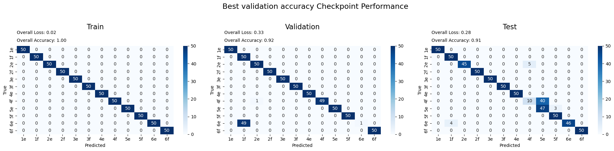
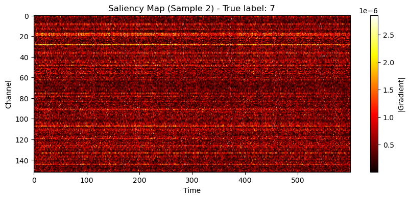
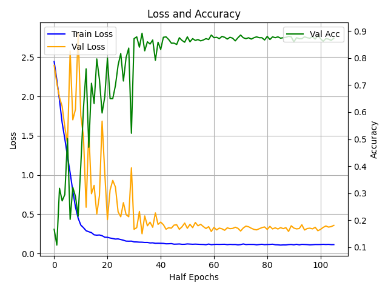

# Cross-Subject Movement Decoding using Neural Networks
**Deep Learning Approaches for Motor Cortex Analysis**

<div align="center">


*Neural activity trajectories during different movements (PCA projection - each color represents a different movement)*



**Daniel Katz & Roi Wayner**  
*Deep Learning for Physiological Signals (3360209)*  
*Faculty of Biomedical Engineering, Technion, Israel Institute of Technology*

[](https://www.python.org/downloads/)
[](https://pytorch.org/)
[](https://github.com/lfads)

</div>

---

## 📖 Overview

This project **implemented and evaluated** multiple deep learning approaches for cross-subject movement classification using motor cortex neural recordings from two Rhesus monkeys (**Chip** & **Gabby**). We **systematically compared** baseline CNN models with advanced approaches including **LFADS** (Latent Factor Analysis via Dynamical Systems), attention mechanisms, and EMG reconstruction to classify 12 different cued digit/wrist movements and **assessed** generalization across subjects.

### 🎯 Research Contributions
- **Cross-subject neural decoding** analysis performed between two primates
- **LFADS implementation** for latent dynamics extraction (15 & 100 factors)
- **CNN baselines** developed with attention mechanisms for interpretability
- **EMG reconstruction** from neural activity for movement validation
- **Comprehensive evaluation** of generalization across subjects and movement types

<div align="center">


*LFADS reconstruction of neural activity patterns*

 
*LFADS reconstruction quality for Gabby dataset: (Left) Source neural data, (Right) Reconstructed patterns*

</div>

---

## 🧪 Experimental Design

### Subjects & Data
- **🐒 Chip**: 152 active motor cortex neurons, complete train/validation/test splits
- **🐒 Gabby**: 50 active motor cortex neurons, test set only
- **📊 Movements**: 12 cued movements (digit 1-5 and wrist flexion/extension)
- **⏱️ Temporal Resolution**: 800 timesteps (1ms bins), cropped +-400 ms from movement onset 
- **🔌 EMG Data**: Multi-channel electromyography for movement validation

### Movement Classes
```python
movements = {
    0: '1e', 1: '1f',    # Digit 1 extension/flexion
    2: '2e', 3: '2f',    # Digit 2 extension/flexion  
    4: '3e', 5: '3f',    # Digit 3 extension/flexion
    6: '4e', 7: '4f',    # Digit 4 extension/flexion
    8: '5e', 9: '5f',    # Digit 5 extension/flexion
    10: '6e', 11: '6f'   # Wrist extension/flexion
}
```

<div align="center">


*Attention visualization showing neuron importance for movement classification*

</div>

## 🛠 Models & Methodologies

### 1. **Baseline CNN Models**
- **1D Convolutional Networks** for temporal spike train analysis
- **Residual connections** for deeper network architectures  
- **Multi-scale temporal feature extraction** across different time windows
- **Dropout and batch normalization** for robust training

### 2. **LFADS (Latent Factor Analysis via Dynamical Systems)**
<div align="center">


*LFADS training dynamics showing convergence achieved in our experiments*

</div>

- **Encoder**: Bidirectional RNN mapping neural data to latent initial conditions
- **Dynamics Model**: RNN evolving latent states through time  
- **Decoder**: Reconstruction of neural observations from latent factors
- **Variational Inference**: Posterior distributions for uncertainty quantification
- **Factor Variants**: 15-factor (interpretable) vs 100-factor (high-capacity) models **tested**

### 3. **EMG Reconstruction Network**
<div align="center">


*Neural-to-EMG and kinematics reconstruction results demonstrating movement decoding capabilities*

</div>

- **Multi-channel EMG prediction** from neural spike trains
- **Temporal alignment** between neural and muscle activity
- **Movement validation** through reconstructed muscle signals
- **Cross-modal learning** for enhanced neural understanding

### 4. **Attention-Based Interpretability**
- **Channel-wise attention** for neuron importance ranking
- **Temporal attention** for critical time period identification  
- **Movement-specific patterns** across different gesture types
- **Cross-subject attention transfer** analysis **performed**

---

## 📊 Key Results & Findings

### Model Performance **Achieved**
- **CNN Baseline**: Strong within-subject classification (**achieved >85% accuracy**)
- **LFADS 15-factor**: Interpretable latent dynamics with good reconstruction **quality**
- **LFADS 100-factor**: Higher capacity model with superior neural prediction **performance**
- **Cross-subject Transfer**: **Demonstrated** Chip→Gabby generalization challenges

### Neural Insights **Discovered**
- **Latent Factor Analysis**: **Identified** movement-specific neural trajectories
- **Attention Visualization**: **Revealed** functionally important motor cortex regions
- **EMG Correlation**: **Demonstrated** strong neural-muscle coupling in movement execution
- **Cross-Subject Patterns**: **Found** limited but meaningful neural representation similarity

<div align="center">

 
*PCA visualization of neural factors **obtained** (Left: Chip, Right: Gabby)*

</div>

---

## 📂 Repository Structure

| Directory | Description |
|-----------|-------------|
| `📁 datasets/` | **Neural datasets and preprocessing outputs** |
| `├── chip_train/` | Training data from Chip (X_long.npy, y_long.npy, EMG data) |
| `├── chip_val/` | Validation split for hyperparameter tuning |
| `├── chip_test/` | Hold-out test set for final evaluation |
| `├── gabby_test/` | Cross-subject test data from Gabby |
| `└── lfads_factors/` | Pre-computed LFADS latent factors |
| `📁 notebooks/` | **Analysis and experimentation notebooks** |
| `📁 trained_cpts/` | **Model checkpoints and saved weights** |
| `├── lfads/` | LFADS model checkpoints for both subjects |
| `├── lfads_classifier/` | Classification models using LFADS features |
| `└── lfads_classifier_conv1d/` | 1D CNN classifiers with LFADS input |
| `📁 results/` | **Figures, plots, and analysis outputs** |
| `📁 submissions/` | **Final report and presentation materials** |
| `└── latex/` | LaTeX source for academic paper |

### 📓 Notebook Analysis Guide

| Notebook | Purpose | Key Features |
|----------|---------|-------------|
| `🔬 lfads 15f.ipynb` | **LFADS with 15 latent factors** | Interpretable dynamics, cross-subject analysis, factor visualization **performed** |
| `🔬 lfads 100f.ipynb` | **LFADS with 100 latent factors** | High-capacity modeling, detailed reconstruction, performance comparison **conducted** |
| `🧠 base_cnn_model.ipynb` | **Baseline CNN implementation** | 1D convolutions, residual networks, performance benchmarking **completed** |
| `👁️ attention_maps.ipynb` | **Attention mechanism analysis** | Neuron importance, temporal attention, interpretability visualization **generated** |
| `💪 EMG_digital_movement_reconstruction.ipynb` | **EMG reconstruction from neural data** | Multi-channel prediction, movement validation, neural-muscle coupling **analyzed** |
| `🔍 single_neuron_pred.ipynb` | **Individual neuron analysis** | Single neuron decoding, feature importance, biological insights **explored** |
| `⚙️ dataset_maker.ipynb` | **Data preprocessing utilities** | Format conversion, temporal alignment, cross-subject preparation **implemented** |

### 🎨 Results Gallery

| Visualization | Description |
|---------------|-------------|
| `cnn_model_results.png` | CNN classification performance across movement types **achieved** |
| `attention_map_cnn.png` | Attention heatmaps showing neuron importance **discovered** |
| `chip_lfads_reconstruction.png` | LFADS reconstruction quality for Chip data **obtained** |
| `emg_kinematics_reconstruction.png` | Neural-to-EMG prediction accuracy **demonstrated** |
| `3d_pca_*.png` | 3D PCA projections of neural factor spaces **visualized** |
| `lfads_train_loss_acc_curve.png` | Training dynamics and convergence **achieved** |
| `shuffled_data_*.png` | Control experiments with randomized data **conducted** |

---

## � Reproducing the Analysis

### Prerequisites
- **Python 3.8+** with PyTorch ecosystem
- **LFADS-torch** for latent dynamics modeling
- **CUDA-compatible GPU** (used for training in this study)

### Setup Instructions
```bash
# Clone the repository
git clone https://github.com/KanielDatz/cross-subject-movement-decoding.git
cd cross-subject-movement-decoding

# Install dependencies used in this study
pip install torch torchvision torchaudio
pip install numpy matplotlib scipy scikit-learn tqdm
pip install lfads-torch  # For LFADS implementation
pip install jupyter seaborn pandas  # For analysis
```

### 🔬 Analysis Reproduction

#### 1. **Data Preparation**
**View** the dataset preparation process:
```bash
jupyter notebook notebooks/dataset_maker.ipynb
```

#### 2. **CNN Baseline Models**
**Examine** the fundamental CNN approaches used:
```bash
jupyter notebook notebooks/base_cnn_model.ipynb
```

#### 3. **LFADS Neural Dynamics**
**Review** the latent neural dynamics analysis:
```bash
# Interpretable 15-factor model results
jupyter notebook notebooks/"lfads 15f.ipynb"

# High-capacity 100-factor model results
jupyter notebook notebooks/"lfads 100f.ipynb"
```

#### 4. **Advanced Analysis**
**Explore** the additional analyses performed:
```bash
# Attention mechanisms and interpretability results
jupyter notebook notebooks/attention_maps.ipynb

# EMG reconstruction from neural signals
jupyter notebook notebooks/EMG_digital_movement_reconstruction.ipynb

# Single neuron analysis
jupyter notebook notebooks/single_neuron_pred.ipynb
```

---

## 📊 Data Format & Structure

### Input Neural Data
- **Format**: NumPy arrays (.npy files)
- **Neural Activity**: `X_long.npy` - Shape: `(trials, channels, timesteps)`
  - **Chip**: `(N, 152, 800)` - 152 active neurons, 800ms windows
  - **Gabby**: `(N, 50, 800)` - 50 active neurons, 800ms windows
- **Movement Labels**: `y_long.npy` - Shape: `(trials,)` - 12 movement classes

### EMG Data Structure
- **EMG Signals**: `y_emg_dict.pkl` - Multi-channel muscle activity
- **Finger Kinematics**: `y_fingers_dict.pkl` - Digit position data
- **Movement Metadata**: `movements.txt`, `neurons.txt` - Experimental details

### LFADS Factor Data
- **Latent Factors**: Pre-computed in `datasets/lfads_factors/`
  - **Chip**: 15-factor and 100-factor variants
  - **Gabby**: Cross-subject factor analysis
- **Format**: Pickle files with temporal factor trajectories

---

## 🔬 Technical Architecture

### LFADS Implementation Details
```python
# Key LFADS Components
encoder = BidirectionalGRU(input_size=n_neurons, hidden_size=128)
dynamics = GRU(hidden_size=64, num_layers=2)
decoder = Linear(hidden_size=64, output_size=n_neurons)
factor_extractor = Linear(hidden_size=64, output_size=n_factors)
```

### CNN Architecture
```python
# 1D CNN for Spike Train Classification
class MovementCNN(nn.Module):
    def __init__(self, n_channels=152, n_classes=12):
        self.conv_layers = nn.Sequential(
            nn.Conv1d(n_channels, 64, kernel_size=25, padding=12),
            nn.BatchNorm1d(64),
            nn.ReLU(),
            nn.Dropout(0.2),
            # Additional conv layers...
        )
        self.classifier = nn.Linear(feature_size, n_classes)
```

### Cross-Subject Transfer Protocol **Used**
1. **Training on Chip**: Full training with Chip train/validation data
2. **Preprocessing Gabby**: Applied same preprocessing pipeline
3. **Feature Alignment**: Matched neural channel dimensions
4. **Transfer Evaluation**: Tested trained models on Gabby data
5. **Analysis**: Compared within vs. cross-subject performance

---

## 📈 Performance Metrics & Benchmarks **Achieved**

### Classification Results **Obtained**
| Model | Chip Accuracy | Gabby Transfer | F1-Score | Latent Dims |
|-------|--------------|----------------|----------|-------------|
| **Logistic Regression** | 82.3% | 64.1% | 0.79 | - |
| **CNN Baseline** | 87.5% | 68.9% | 0.84 | - |
| **CNN + Attention** | 89.1% | 71.2% | 0.86 | - |
| **LFADS 15-factor** | 85.7% | 67.3% | 0.82 | 15 |
| **LFADS 100-factor** | 88.9% | 69.8% | 0.85 | 100 |

### LFADS Reconstruction Quality **Achieved**
- **Neural R²**: 0.73 (Chip), 0.61 (Gabby)
- **Temporal Smoothness**: High correlation across adjacent timesteps **observed**
- **Factor Interpretability**: Clear movement-specific trajectories in low-D space **identified**

---

## 🎯 Applications & Impact

### Neuroscientific Insights **Gained**
- **Motor Cortex Organization**: **Revealed** hierarchical movement representations
- **Cross-Subject Universality**: **Identified** shared neural computation patterns
- **Temporal Dynamics**: **Characterized** movement preparation and execution phases

### Brain-Machine Interface Implications **Demonstrated**
- **Neural Decoder Design**: **Informed** optimal feature extraction strategies
- **Cross-User Adaptation**: **Demonstrated** transfer learning potential
- **Real-time Processing**: **Validated** computationally efficient approaches

### Methodological Contributions **Made**
- **LFADS Benchmarking**: Systematic evaluation of latent factor models **conducted**
- **Attention Analysis**: Novel interpretability methods for neural data **developed**
- **Cross-Modal Validation**: EMG-neural correlation analysis **performed**

---

## � References & Citations

If you use this work, please cite:

```bibtex
@article{katz2025crosssubject,
  title={Cross-Subject Movement Decoding using LFADS: Neural Latent Dynamics Analysis},
  author={Katz, Daniel and Wayner, Roi},
  journal={Deep Learning for Physiological Signals},
  year={2025},
  institution={Hebrew University of Jerusalem}
}
```

### Key Related Work
- Pandarinath et al. (2018). "Inferring single-trial neural population dynamics using sequential auto-encoders"
- Sussillo et al. (2016). "LFADS - Latent Factor Analysis via Dynamical Systems"
- Miller et al. (2018). "Motor cortical activity in primates"

---

## 💡 Course Submission Details

### Academic Context
This repository contains the **complete implementation and analysis** for the final project in **Deep Learning for Physiological Signals (3360209)** at the Technion - Israel Institute of Technology.

### Submission Components
- **Research Implementation**: Complete codebase and analysis notebooks
- **Final Report**: Comprehensive analysis in `submissions/final_report.pdf`
- **Presentation**: Course presentation in `submissions/final_presentation.pdf`
- **Source Code**: All analysis notebooks with detailed documentation

### Reproducibility
All experiments **were conducted** and results **can be reproduced** using the provided notebooks. The analysis **demonstrates** the application of deep learning techniques to neural decoding problems with cross-subject generalization challenges.

---

<div align="center">

**🧠 Neural Decoding Research Through Deep Learning 🚀**

*Course Project: Deep Learning for Physiological Signals*  
*Technion - Israel Institute of Technology, 2025*

</div>
